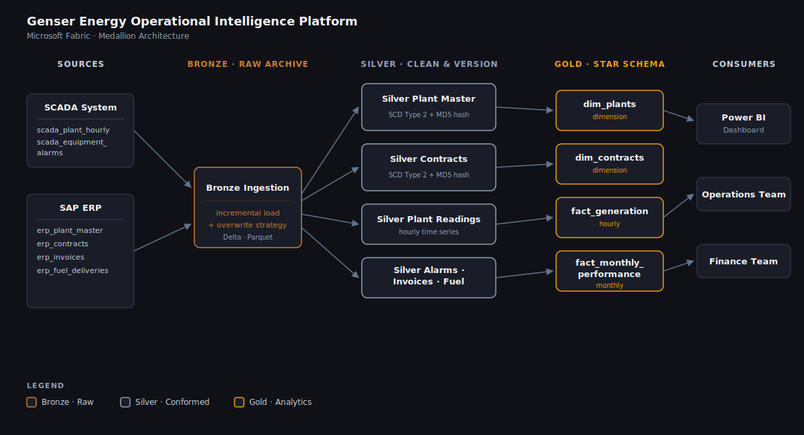

# Genser Energy — Operational Intelligence Platform


A production-grade medallion lakehouse pipeline built on **Microsoft Fabric**, unifying SCADA plant telemetry and SAP ERP contracts and billing data for Genser Energy — an independent power producer operating **five natural-gas-fired plants across Ghana** serving major gold mining companies under long-term Power Purchase Agreements.

---

## The Problem

Genser Energy's operational data lived in two completely separate systems: a **SCADA system** capturing plant telemetry every three hours, and **SAP ERP** managing contracts, billing, and fuel deliveries. Neither system talked to the other.

Finance couldn't reconcile invoices against actual energy delivered. Operations couldn't track whether plants were meeting their contracted availability thresholds. When a mining client asked "why did you charge us $X this month?", the answer required pulling two separate reports and joining them manually in Excel — assuming the plant IDs even matched.

This pipeline fixes that.

---

## What It Produces

By the time this pipeline finishes each night, four tables are ready for reporting:

**dim_plants** — one row per plant, combining current plant specs with the active PPA contract. The foundation of every dashboard.

**dim_contracts** — every version of every Power Purchase Agreement, preserved with validity windows. When a tariff is renegotiated, the old rate is not overwritten — it is closed and archived. Billing audits and regulatory compliance depend on this.

**fact_generation** — 14,600 hourly generation readings per year, joined to plant and contract dimensions, with derived KPIs: energy produced, heat rate, plant availability, estimated revenue per reading.

**fact_monthly_performance** — monthly rollup table combining generation, fuel cost, and invoice data into the five metrics that matter most: Availability Factor, Capacity Factor, Contracted Delivery %, Fuel Cost/MWh, and Revenue Billed vs Collected.

---

## Architecture



The pipeline runs in three stages across three Fabric Lakehouses.

**Bronze** (`bronze_lh`) is the permanent raw archive. Data arrives as CSV exports from SCADA and SAP, tagged with ingestion timestamp and source system. Nothing is ever changed or deleted here. SCADA tables are ingested incrementally using a timestamp watermark. ERP reference tables are full overwrites.

**Silver** (`silver_lh`) is where cleaning, validation, and versioning happen. The two most critical tables — `plant_master` and `contracts` — use **SCD Type 2** with **hash-based change detection**: all business columns are concatenated and hashed; if the hash changes between runs, the old record is closed and a new version is created. Rows that fail data quality checks (null business keys, negative tariffs, physically impossible readings) are quarantined to `dq_quarantine` rather than dropped silently.

**Gold** (`gold_lh`) is what the business actually uses. Silver tables are joined, KPIs are computed, and the results land in a clean star schema that connects directly to Power BI — no export step, no connector overhead.

---

## Source Data

Six tables ingested from two source systems:

| Source | Table | Strategy | What It Contains |
|--------|-------|----------|-----------------|
| SCADA  | `scada_plant_hourly`     | Incremental | Hourly MW output, fuel consumed, heat rate, status |
| SCADA  | `scada_equipment_alarms` | Incremental | Turbine/generator alarms with severity and duration |
| SAP ERP | `erp_plant_master`      | Overwrite   | Plant specs, installed/available capacity, client |
| SAP ERP | `erp_contracts`         | Overwrite   | Power Purchase Agreements — tariff, contracted MW |
| SAP ERP | `erp_invoices`          | Incremental | Monthly billing records per plant |
| SAP ERP | `erp_fuel_deliveries`   | Incremental | Gas delivery volumes and costs from GNPC |

Demo data for all six tables is included in `/data/` — generated from Genser's real plant specifications, actual client relationships, and realistic operational parameters.

---

## Operational Assets

| Plant | Location | Installed MW | Available MW | Client |
|-------|----------|-------------|--------------|--------|
| Tarkwa  | Western Region  | 66 MW  | 58 MW  | Gold Fields Limited |
| Chirano | Ashanti Region  | 33 MW  | 31 MW  | Kinross Gold Corporation |
| Damang  | Western Region  | 25.5 MW | 25.5 MW | Gold Fields Limited |
| Edikan  | Central Region  | 33 MW  | 33 MW  | Perseus Mining Limited |
| Wassa   | Western Region  | 33 MW  | 32 MW  | Golden Star Resources |

---

## Key Engineering Decisions

**SCD Type 2 on contracts — not just a design choice, a business requirement.**
Power Purchase Agreements between Genser and mining clients get renegotiated. When a tariff changes from $92/MWh to $98.50/MWh, the old rate cannot be overwritten — every historical invoice was calculated against the old rate. SCD Type 2 preserves every contract version with effective dates, making billing audits and dispute resolution possible.

**SCD Type 2 on plant_master — because capacity is not constant.**
Genser de-rates plant available capacity after major turbine inspections. If we overwrite the plant record, we lose the ability to verify whether a plant was operating within or outside its rated capacity during a specific billing period — a contractual compliance question.

**Hash-based change detection — O(1) comparison at any column count.**
Rather than comparing every column individually, all business columns are concatenated with a delimiter and hashed (MD5). One hash comparison per row, regardless of schema width. If the hash matches, the record is skipped. If it changes, a new SCD2 version is created. Computationally simple and schema-change tolerant.

**Deterministic surrogate keys — SHA-256(business_key + effective_date).**
Auto-increment keys are fragile: if a table is rebuilt, every key changes, breaking every foreign key in Gold and every saved Power BI report. SHA-256 keys are derived from the data itself — re-running the pipeline 10 times produces identical keys. Dashboards never break.

**Two Gold fact tables — different grains for different consumers.**
Operations needs hourly granularity to spot heat rate deviations and real-time availability. Finance needs monthly to reconcile energy delivered against invoices. Both are built from the same Silver source, ensuring a single version of the truth at two different grain sizes.

**Data quality quarantine — surface problems, don't hide them.**
Every Silver notebook writes rejected rows to `dq_quarantine` with a reason code and timestamp rather than silently dropping them. A growing quarantine count signals a data quality issue upstream — it becomes visible in monitoring rather than manifesting as a silent gap in a dashboard.

---

## Gold Layer KPIs

| Metric | Definition | Where Used |
|--------|-----------|-----------|
| **Availability Factor %** | Hours available / total hours in period | Both |
| **Capacity Factor %** | Actual MWh / (installed MW × hours) | Operations |
| **Contracted Delivery %** | Actual MWh / contracted MWh × 100 | Finance |
| **Heat Rate (BTU/kWh)** | Fuel energy in / electrical energy out | Operations |
| **Fuel Cost / MWh** | Total fuel spend / total energy produced | Finance |

---

## Tech Stack

| Component | Technology |
|-----------|-----------|
| Compute & notebooks | Microsoft Fabric (Spark) |
| Storage format | Delta Lake (throughout all layers) |
| Orchestration | Data Factory pipeline |
| Scheduling | Daily trigger — 02:00 AM |
| Transformations | PySpark |
| Versioning | SCD Type 2 with MD5 hash detection |
| Surrogate keys | SHA-256 deterministic |
| BI layer | Power BI (direct Lakehouse connection) |

---

## Folder Structure

```
genser-energy-fabric-lakehouse/
├── notebooks/
│   ├── 00_config.py                   # Workspace config — update WORKSPACE_NAME
│   ├── 01_bronze_ingestion.py         # SCADA + SAP ERP → Bronze Delta tables
│   ├── 02_silver_plant_master.py      # SCD Type 2 — plant capacity history
│   ├── 03_silver_contracts.py         # SCD Type 2 — PPA tariff history ★
│   ├── 04_silver_plant_readings.py    # Incremental — hourly SCADA data + KPIs
│   ├── 05_silver_alarms_invoices_fuel.py  # Alarms, invoices, fuel deliveries
│   ├── 06_gold_dim_plants.py          # Plant + contract dimension
│   ├── 07_gold_dim_contracts.py       # All PPA versions for audit
│   └── 08_gold_fact_generation.py     # Hourly + monthly performance facts
├── data/
│   ├── scada_plant_hourly.csv         # 14,600 rows — 5 plants × 365 days
│   ├── scada_equipment_alarms.csv     # 1,800 alarm events
│   ├── erp_plant_master.csv           # 5 plant records
│   ├── erp_contracts.csv              # 6 contract records (inc. 1 historical)
│   ├── erp_invoices.csv               # 60 monthly invoices
│   └── erp_fuel_deliveries.csv        # 900 gas delivery records
├── architecture/
│   └── pipeline_architecture.svg     # Full pipeline diagram
```

---

## How to Run

### Prerequisites

- Microsoft Fabric workspace (trial or paid)
- Three Lakehouses created: `bronze_lh`, `silver_lh`, `gold_lh`

### Step 1 — Upload source data

In `bronze_lh`, navigate to **Files** → create folder `source_data` → upload all six CSV files from `/data/`.

### Step 2 — Create notebooks

Create one notebook per `.py` file in `/notebooks/`. For each notebook:
1. Set the **Default Lakehouse** as shown in the notebook header comment
2. Paste the cell contents
3. Update `WORKSPACE_NAME` at the top to match your exact workspace name

| Notebook | Default Lakehouse |
|----------|------------------|
| 01_bronze_ingestion | `bronze_lh` |
| 02–05 Silver notebooks | `silver_lh` |
| 06–08 Gold notebooks | `gold_lh` |

### Step 3 — Run manually first

Run notebooks in order: `01 → 02,03,04,05 (parallel) → 06,07 (parallel) → 08`

Each notebook ends with a validation summary and `✅ COMPLETE`.

### Step 4 — Wire the Data Factory pipeline

Create a new **Data pipeline** with this DAG:

```
[01_bronze_ingestion]
         │
    ┌────┴──────────────────────────────────────┐
[02_silver_plant_master]           [03_silver_contracts]
[04_silver_plant_readings]   [05_silver_alarms_invoices_fuel]
    └────────────────┬──────────────────────────┘
             ┌───────┴────────┐
   [06_gold_dim_plants]  [07_gold_dim_contracts]
             └───────┬────────┘
         [08_gold_fact_generation]
```

Green (On Success) arrows between each stage. Schedule: **Daily at 02:00 AM**.

### Step 5 — Connect Power BI

Get Data → Microsoft Fabric → Lakehouse → `gold_lh`

Import `dim_plants`, `dim_contracts`, `fact_generation`, `fact_monthly_performance`.

Relationships:
- `fact_generation[plant_key]` → `dim_plants[plant_key]`
- `fact_monthly_performance[plant_id]` → `dim_plants[plant_id]`

---

## Pipeline Schedule

```
Bronze ingestion   ─── 02:00 AM  (watermark-based incremental)
Silver transforms  ─── 02:05 AM  (6 notebooks in parallel)
Gold build         ─── 02:20 AM  (dims first, facts last)
Power BI refresh   ─── 02:35 AM  (automatic on dataset refresh)
```

---

## About Genser Energy

Genser Energy is an independent power producer headquartered in Washington DC, with operations across West Africa. The company designs, finances, builds, and operates natural gas and power infrastructure assets serving industrial and mining clients, with over 200MW installed capacity in Ghana and a 425km natural gas pipeline network connected to the Ghana National Gas Company grid.

[genserenergy.com](https://genserenergy.com)

---

*Built with Microsoft Fabric · Delta Lake · PySpark · Data Factory*
